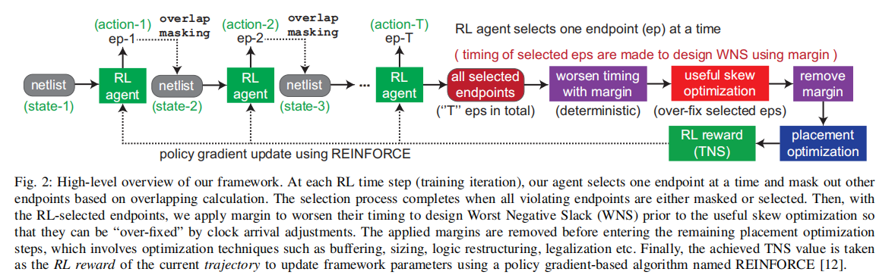
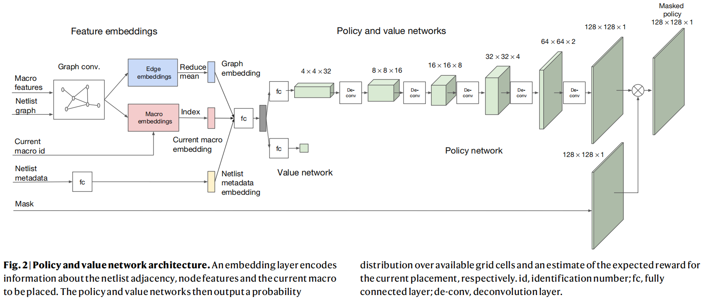
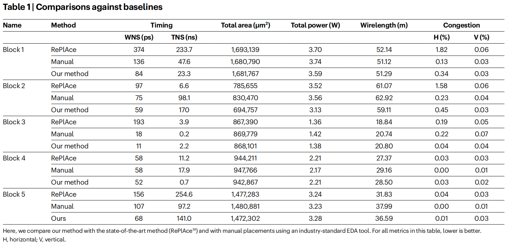
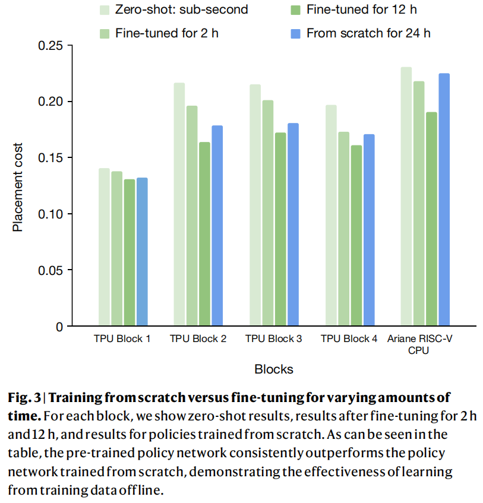
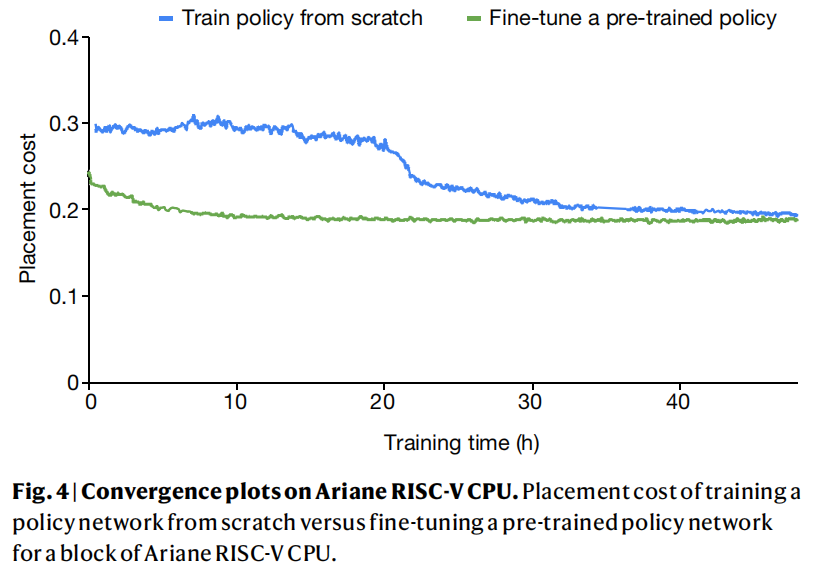

## 2023-Yichen Lu-RL-CCD
### Abstract
* 背景: 
  * 并发时钟和数据（CCD）优化是现代商业工具中一种被广泛采用的方法，它使用时钟倾斜和延迟固定策略的混合物来解决定时违规。
  * Concurrent Clock and Data (CCD) optimization is a well adopted approach in modern commercial tools that resolves timing violations using a mixture of clock skewing and delay fixing strategies.
* 问题：
  * 然而，现有的CCD算法存在缺陷。特别是，它们没有正确地对不同优化策略的违反端点进行优先排序，导致了全局次优结果。 
  * However, existing CCD algorithms are flawed. Particularly, they fail to prioritize violating endpoints for different optimization strategies
correctly, leading to flow-wise globally sub-optimal results.
* 目标：
  * 我们通过介绍RL-CCD来克服这个问题，这是一种强化学习（RL）代理，它选择端点进行有用的倾斜优先级
  * we overcome this issue by presenting RL-CCD, a Reinforcement Learning (RL) agent that selects endpoints for useful skew prioritization
* 途径：
  * 利用所提出的EP-GNN，一个面向端点的图神经网络（GNN）模型，以及一个基于变压器的自监督注意机制。
  * using the proposed EP-GNN, an endpoint-oriented Graph Neural Network (GNN) model, and a Transformer-based self-supervised attention mechanism.
* 结果：
  * 在5−12nm技术的19种工业设计上的实验结果表明，与商业工具相比，RL-CCD实现了高达64%的总负松弛（TNS）减少和66.5%的违反端点（NVE）改进。
  * Experimental results on 19 industrial designs in 5−12nm technologies
demonstrate that RL-CCD achieves up to 64% Total Negative Slack
(TNS) reduction and 66.5% number of violating endpoints (NVE)
improvement over the native implementation of a commercial tool.

---
    "Clock skewing" 和 "delay (logic) fixing" 是数字电路设计中使用的术语，它们与电路的时序特性有关。
    
    1. Clock Skewing (时钟偏斜):
    Clock skew 是指在数字电路中，不同部分接收到时钟信号的时间差异。在一个同步数字系统中，理想情况下所有触发器都应该在同一个时钟边沿触发，但由于信号传播延迟的不同，实际上时钟信号到达各个触发器的时间会有细微的差别，这就是时钟偏斜。
    时钟偏斜可以是自然的，也可以是故意引入的。时钟偏斜的调整，即 clock skewing，是一种技术，用于通过改变时钟路径的延迟来调整时钟信号到达各个触发器的时间，目的是为了减少时钟偏斜的影响，提高电路的同步性和性能。正面的时钟偏斜可以用来平衡不同的信号路径，确保数据在正确的时钟周期内稳定。
    2. Delay (Logic) Fixing (延迟(逻辑)修复):
    Delay fixing 是指在数字电路设计中，对逻辑路径的延迟进行调整，以确保所有的信号都能在正确的时钟周期内到达目的地。这通常涉及到以下几种操作：
    - 增加延迟（Inserting Delays）：如果某个信号路径比预期更快，可能会在该路径上插入额外的延迟元件（如缓冲器、延迟线等），以使其与其他路径同步。
    - 减少延迟（Reducing Delays）：如果某个信号路径比预期更慢，可能需要优化该路径的设计，减少延迟，以便信号能够及时到达。
    逻辑延迟修复的目的是为了满足电路的时序要求，确保数据在时钟周期内的稳定性和可靠性，避免时序违例（timing violations）的发生，从而提高电路的整体性能和可靠性。这通常涉及到使用时序分析工具来识别和修复时序问题。
---
#### 执行流程
在每个RL时间步（训练迭代）中，智能体选择一个端点，并根据重叠计算屏蔽其他端点。当所有违规端点被屏蔽或选中后，选择过程完成。接着，对RL选中的端点应用时序余量以设计最差负slack（WNS），为后续的时钟偏斜优化做准备。

在剩余的布局优化步骤之前，移除应用的余量，并使用缓冲、调整尺寸、逻辑重构和合法化等技术进行优化。最后，实现的TNS值作为当前轨迹的RL奖励，用于通过名为REINFORCE的政策梯度算法更新框架参数。

### 优缺点
优点：1.效果提升的原理很简单，所有的时序违例点中，一部分适合时间路径修复，另一部分适合数据路径修复。传统EDA工具没有针对这个问题进行优化。2.对现有的EDA工具流程没有影响，容易融入到现有的EDA流程中。3.效果不错，在19个商业设计方案中，取得平均降低23%的TNS，平均降低19%的NVE。

缺点：1.针对每个芯片设计方案需要从头开始训练，训练时间长，对机器性能要求高。

### 成熟度
在19个商业设计方案中都取得不错的优化效果，但是没有找个开源代码，也未集成进现有EDA工具中。

----

## A graph placement methodology for fast chip design

### Abstract
* 背景：
芯片布局规划是一项复杂的工程任务，涉及设计计算机芯片的物理布局。尽管经过数十年的研究，这一过程仍然难以自动化，通常需要物理设计工程师数月的努力才能生成可制造的布局。

* 目标：
提出一种深度强化学习方法来解决芯片布局规划问题，旨在自动生成高质量的芯片布局，同时节省时间和人力资源。

* 效果：
  1. 在不到六个小时内，方法能够自动生成在所有关键指标上都优于或相当于人工生成的芯片布局，包括功耗、性能和芯片面积。
  2. 通过学习芯片的丰富且可迁移的表示，方法能够利用过去的经验，在解决新问题实例时变得更好、更快。
  3. 该方法已被用于设计谷歌下一代的人工智能（AI）加速器，并且有可能为每一代新产品节省数千小时的人力。

---

### Chip floorplanning as a learning problem

在每次迭代中，强化学习智能体（策略网络）依次放置宏单元。一旦所有宏单元放置完毕，我们使用一种基于力的方法11,25–27来近似放置标准单元簇。在每次迭代的末尾，奖励计算为近似线长、拥塞和密度的线性组合（公式2）。在我们的实验中，拥塞权重λ设置为0.01，密度权重γ设置为0.01，最大密度阈值设置为0.6

**公式2**

$ R_{p, g} = -Wirelength(p, g) - \lambda \cdot Congestion(p, g) - \gamma \cdot Density(p, g) $

其中g表示一个芯片设计方案的网表，p表示这个网表的一种放置方案。RL算法使用PPO。

### Designing domain-adaptive policies

使用Edge-GNN对网表进行预处理，使用下面的公式计算边和节点的embedding表示。

$ e_{ij} = fc_e (concat(v_i, v_j | w_{ij}^e)) $

$ v_i = mean_{j\in Neighbor(v_i)} (e_{ij})$

+ **资源**： 我们的方法在预训练时使用了与训练数据集块数相同的工作进程，预训练需要48小时。微调时，使用16个工作进程，最多6小时。每个工作进程包含一个Nvidia Volta GPU和10个CPU（每个2GB RAM）。在零样本模式下，单个GPU上不到一秒生成布局。

---

### 实验结果

在给定的底层工艺技术节点的约束下，如果WNS（最坏负时序松弛）显著高于150 ps，或者水平或垂直拥塞超过1%，那么在设计流程的后期阶段，布局将无法满足时序约束，导致许多RePlAce布局（如块1、2、3）变得不可用。

> TNS为什么会小于WNS???

> Zero-shot表示直接使用训练好的模型，不进行任何微调，scratch 表示重头开始训练，其他两个表示在预训练模型的基础上进行不同时间的微调。
> 实验结果表明，微调12小时模型总是优于从头训练。

> 微调模型相比重头训练，不仅起步效果好，训练（微调）时间也更短。
