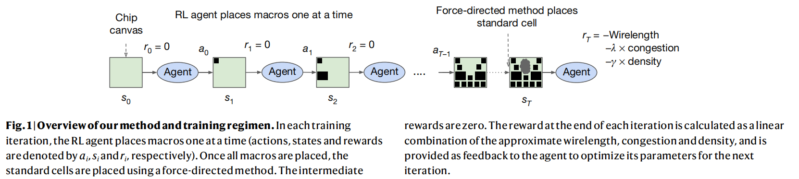

## 2023-Yichen Lu-RL-CCD
### Abstract
* 背景: 
  * 并发时钟和数据（CCD）优化是现代商业工具中一种被广泛采用的方法，它使用时钟倾斜和延迟固定策略的混合物来解决定时违规。
  * Concurrent Clock and Data (CCD) optimization is a well adopted approach in modern commercial tools that resolves timing violations using a mixture of clock skewing and delay fixing strategies.
* 问题：
  * 然而，现有的CCD算法存在缺陷。特别是，它们没有正确地对不同优化策略的违反端点进行优先排序，导致了全局次优结果。 
  * However, existing CCD algorithms are flawed. Particularly, they fail to prioritize violating endpoints for different optimization strategies
correctly, leading to flow-wise globally sub-optimal results.
* 目标：
  * 我们通过介绍RL-CCD来克服这个问题，这是一种强化学习（RL）代理，它选择端点进行有用的倾斜优先级
  * we overcome this issue by presenting RL-CCD, a Reinforcement Learning (RL) agent that selects endpoints for useful skew prioritization
* 途径：
  * 利用所提出的EP-GNN，一个面向端点的图神经网络（GNN）模型，以及一个基于变压器的自监督注意机制。
  * using the proposed EP-GNN, an endpoint-oriented Graph Neural Network (GNN) model, and a Transformer-based self-supervised attention mechanism.
* 结果：
  * 在5−12nm技术的19种工业设计上的实验结果表明，与商业工具相比，RL-CCD实现了高达64%的总负松弛（TNS）减少和66.5%的违反端点（NVE）改进。
  * Experimental results on 19 industrial designs in 5−12nm technologies
demonstrate that RL-CCD achieves up to 64% Total Negative Slack
(TNS) reduction and 66.5% number of violating endpoints (NVE)
improvement over the native implementation of a commercial tool.

---
    "Clock skewing" 和 "delay (logic) fixing" 是数字电路设计中使用的术语，它们与电路的时序特性有关。
    
    1. Clock Skewing (时钟偏斜):
    Clock skew 是指在数字电路中，不同部分接收到时钟信号的时间差异。在一个同步数字系统中，理想情况下所有触发器都应该在同一个时钟边沿触发，但由于信号传播延迟的不同，实际上时钟信号到达各个触发器的时间会有细微的差别，这就是时钟偏斜。
    时钟偏斜可以是自然的，也可以是故意引入的。时钟偏斜的调整，即 clock skewing，是一种技术，用于通过改变时钟路径的延迟来调整时钟信号到达各个触发器的时间，目的是为了减少时钟偏斜的影响，提高电路的同步性和性能。正面的时钟偏斜可以用来平衡不同的信号路径，确保数据在正确的时钟周期内稳定。
    2. Delay (Logic) Fixing (延迟(逻辑)修复):
    Delay fixing 是指在数字电路设计中，对逻辑路径的延迟进行调整，以确保所有的信号都能在正确的时钟周期内到达目的地。这通常涉及到以下几种操作：
    - 增加延迟（Inserting Delays）：如果某个信号路径比预期更快，可能会在该路径上插入额外的延迟元件（如缓冲器、延迟线等），以使其与其他路径同步。
    - 减少延迟（Reducing Delays）：如果某个信号路径比预期更慢，可能需要优化该路径的设计，减少延迟，以便信号能够及时到达。
    逻辑延迟修复的目的是为了满足电路的时序要求，确保数据在时钟周期内的稳定性和可靠性，避免时序违例（timing violations）的发生，从而提高电路的整体性能和可靠性。这通常涉及到使用时序分析工具来识别和修复时序问题。
---
#### 执行流程
在每个RL时间步（训练迭代）中，智能体选择一个端点，并根据重叠计算屏蔽其他端点。当所有违规端点被屏蔽或选中后，选择过程完成。接着，对RL选中的端点应用时序余量以设计最差负slack（WNS），为后续的时钟偏斜优化做准备。

在剩余的布局优化步骤之前，移除应用的余量，并使用缓冲、调整尺寸、逻辑重构和合法化等技术进行优化。最后，实现的TNS值作为当前轨迹的RL奖励，用于通过名为REINFORCE的政策梯度算法更新框架参数。

### 优缺点
优点：1.效果提升的原理很简单，所有的时序违例点中，一部分适合时间路径修复，另一部分适合数据路径修复。传统EDA工具没有针对这个问题进行优化。2.对现有的EDA工具流程没有影响，容易融入到现有的EDA流程中。3.效果不错，在19个商业设计方案中，取得平均降低23%的TNS，平均降低19%的NVE。

缺点：1.针对每个芯片设计方案需要从头开始训练，训练时间长，对机器性能要求高。

### 成熟度
在19个商业设计方案中都取得不错的优化效果，但是没有找个开源代码，也未集成进现有EDA工具中。

----

## A graph placement methodology for fast chip design

### Abstract
* 背景：
芯片布局规划是一项复杂的工程任务，涉及设计计算机芯片的物理布局。尽管经过数十年的研究，这一过程仍然难以自动化，通常需要物理设计工程师数月的努力才能生成可制造的布局。

* 目标：
提出一种深度强化学习方法来解决芯片布局规划问题，旨在自动生成高质量的芯片布局，同时节省时间和人力资源。

* 效果：
  1. 在不到六个小时内，方法能够自动生成在所有关键指标上都优于或相当于人工生成的芯片布局，包括功耗、性能和芯片面积。
  2. 通过学习芯片的丰富且可迁移的表示，方法能够利用过去的经验，在解决新问题实例时变得更好、更快。
  3. 该方法已被用于设计谷歌下一代的人工智能（AI）加速器，并且有可能为每一代新产品节省数千小时的人力。

---

### Chip floorplanning as a learning problem

在每次迭代中，强化学习智能体（策略网络）依次放置宏单元。一旦所有宏单元放置完毕，我们使用一种基于力的方法11,25–27来近似放置标准单元簇。在每次迭代的末尾，奖励计算为近似线长、拥塞和密度的线性组合（公式2）。在我们的实验中，拥塞权重λ设置为0.01，密度权重γ设置为0.01，最大密度阈值设置为0.6

**公式2**

$ R_{p, g} = -Wirelength(p, g) - \lambda \cdot Congestion(p, g) - \gamma \cdot Density(p, g) $

其中g表示一个芯片设计方案的网表，p表示这个网表的一种放置方案。RL算法使用PPO。

### Designing domain-adaptive policies

使用Edge-GNN对网表进行预处理，使用下面的公式计算边和节点的embedding表示。

$ e_{ij} = fc_e (concat(v_i, v_j | w_{ij}^e)) $

$ v_i = mean_{j\in Neighbor(v_i)} (e_{ij})$

+ **资源**： 我们的方法在预训练时使用了与训练数据集块数相同的工作进程，预训练需要48小时。微调时，使用16个工作进程，最多6小时。每个工作进程包含一个Nvidia Volta GPU和10个CPU（每个2GB RAM）。在零样本模式下，单个GPU上不到一秒生成布局。

---

### 实验结果

在给定的底层工艺技术节点的约束下，如果WNS（最坏负时序松弛）显著高于150 ps，或者水平或垂直拥塞超过1%，那么在设计流程的后期阶段，布局将无法满足时序约束，导致许多RePlAce布局（如块1、2、3）变得不可用。

> TNS为什么会小于WNS???

> Zero-shot表示直接使用训练好的模型，不进行任何微调，scratch 表示重头开始训练，其他两个表示在预训练模型的基础上进行不同时间的微调。
> 实验结果表明，微调12小时模型总是优于从头训练。

> 微调模型相比重头训练，不仅起步效果好，训练（微调）时间也更短。

### Methods

#### 奖励函数&近似方法
我们的目标是在布线拥塞和密度约束下最小化PPA（性能、功耗和面积）。我们使用商业EDA工具的输出作为奖励，包括线长、拥塞、密度、功耗、时序和面积。为了有效学习RL策略，奖励函数需要快速评估，我们采用线长作为成本的一部分，因为它评估成本低且与功耗和性能相关。
我们通过代理线长、拥塞和密度的加权总和将多个目标组合成一个奖励函数，权重用于探索这些指标之间的权衡。拥塞被视为软约束，而密度被视为硬约束。为了保持迭代时间短，我们应用了几个近似，包括将标准单元分组到集群、离散化网格、简化线长计算和考虑最拥塞网格单元的平均拥塞。
芯片网表由宏单元和标准单元组成，标准单元可以近似为点进行优化，而宏单元由于面积较大，需要不同的放置方法。我们选择针对宏单元放置，因为这是一个更具挑战性的问题，以前需要人类专家迭代数月才能生成高质量的布局。

#### Selection of macro order

首先根据宏单元的大小进行降序排序，并在大小相同的情况下使用拓扑排序来打破平局

## BENCHMARKING END-TO-END PERFORMANCE OF AI-BASED CHIP PLACEMENT ALGORITHMS

### Abstract
现代VLSI设计的复杂性凸显了EDA技术的重要性，特别是芯片布局步骤。AI算法在芯片布局方面显示出潜力，但其评估往往基于与最终设计性能不完全匹配的中间指标。为了解决这一问题，我们开发了ChiPBench，这是一个全面的基准，旨在评估AI算法在提高最终设计PPA指标方面的有效性。通过在多种电路设计上测试最先进的AI布局算法，并将结果与物理实现流程相结合，我们发现即使某些算法在中间指标上表现优异，其最终PPA结果可能并不理想。这表明，AI社区应更加关注提高整体性能，而不仅仅是中间指标。ChiPBench提供了一个有效的评估框架，有助于弥合学术界和工业界之间的差距。

### Introduction

+ **背景**： 集成电路（IC）的快速发展使得芯片设计变得更加复杂，芯片布局是设计流程中的一个关键步骤，旨在优化性能、功率和面积（PPA）。

+ **问题**： 现有基于AI的芯片布局算法在评估时，通常使用中间指标，这些指标与最终设计的PPA指标不一致，限制了这些算法在实际工业场景中的应用。

+ **解决方案**：
提出ChiPBench，一个开源且可重复的基准，用于评估AI芯片布局算法对最终PPA的提升。实验表明，中间指标与最终PPA关联性弱，强调优化最终PPA的重要性。ChiPBench有助于弥合学术与工业界的差距。

### DATASET GENERATION PIPELINE
使用开源EDA工具OpenROAD来生成数据集，它集成了多个工具用于逻辑综合、宏布局、单元布局、时钟树综合和详细布线。数据集生成从Verilog文件开始，通过OpenROAD转换为网表和物理布局，然后生成LEF/DEF文件以供后续处理，并完成布局、CTS和布线等阶段的数据生成。

### ALGORITHMS
基于AI的芯片布局算法大致可以分为三类：黑盒优化（BBO）方法、分析（基于梯度）方法和强化学习（RL）方法。每一类都将布局任务视为一个优化问题，但采用了不同的目标和策略。以下是详细说明：
1. 黑盒优化（BBO）方法：
   这类方法将布局问题视为一个黑盒，通常使用遗传算法、模拟退火、粒子群优化等全局优化算法。它们不需要了解内部细节，而是通过迭代搜索来找到最优解。BBO方法适用于问题复杂度高、没有显式数学模型的情况。
2. 分析方法（基于梯度）：
   这类方法依赖于目标函数的梯度信息来进行优化。常见的算法包括梯度下降、牛顿法和共轭梯度法等。它们需要目标函数是可微分的，并且通常能够找到局部最优解。分析方法在处理连续和可导的优化问题时非常有效。
3. 强化学习（RL）方法：
   强化学习通过学习策略来解决问题，其中智能体通过与环境交互来学习如何最大化累积奖励。在芯片布局中，RL方法可以将布局视为一个序列决策问题，智能体通过尝试不同的布局决策来学习最佳策略。RL方法适用于动态和不确定的环境，能够处理复杂的目标和约束。
每种方法都有其优势和局限性，选择哪种方法取决于具体问题的性质、可用的数据和计算资源。在实际应用中，这些方法可能需要结合使用，以达到最佳的性能和效率。

芯片布局任务可以被视为一个黑盒优化问题，其中解决方案的评估仅基于输出指标。模拟退火（SA）是一种简单的BBO算法，通过扰动解空间来生成解决方案，并根据退火温度以概率方式接受解决方案，以追求全局最优解。SA算法因其实现简单而常作为基线使用。此外，WireMask-EA是一种新的BBO框架，利用Wiremask贪婪地指导从基因型到表现型的映射，并实现了多种BBO算法。

分析方法将芯片布局优化目标表示为模块坐标的函数，允许使用二次规划和梯度下降等技术进行高效求解。DREAMPlace是一个GPU加速的布局框架，利用可微分的代理目标，如近似HPWL，来优化布局。AutoDMP扩展了DREAMPlace，通过自动调整超参数来加速优化过程，展示了将GPU加速与机器学习结合在VLSI设计自动化中的潜力。

随着VLSI系统复杂性的增加，强化学习（RL）方法被探索以提升布局质量。GraphPlace将宏单元布局建模为RL问题，而DeepPR和PRNet建立了包含宏单元布局、单元布局和布线的流程。然而，它们将密度视为软约束，可能导致训练过程中的非重叠约束违规。MaskPlace和ChiPFormer是最近的最先进算法，具有硬性非重叠约束。MaskPlace使用像素级别的视觉输入和密集奖励来提高样本效率，而ChiPFormer是第一个离线RL方法，通过预训练和微调显著减少了布局时间。

### EVALUATION

#### Metrics

+ **Final DESIGN PPA METRIC**： EDA工作流程旨在优化芯片的性能、功率和面积（PPA）指标。这些指标通过WNS、TNS、NVP等关键时序性能指标来评估。WNS和TNS帮助识别电路中的关键时序问题，而NVP则提供了时序违规的总体数量。尽管PPA优化是行业重点，但在AI社区中尚未得到充分重视。本基准旨在通过结合AI策略来改进PPA优化。

+ **Intermediate METRIC**： 在芯片设计过程中，拥塞、线长（WL）、半周长线长（HPWL）和宏HPWL（mHPWL）是常用的中间代理指标。拥塞用于评估芯片区域的线密度，对布线阶段有重要影响。WL是芯片中所有模块连接线的总长度，而HPWL是每个网络中所有引脚的边界框半周长的总和，用于估计WL。mHPWL仅考虑宏单元，简化了HPWL的计算，并在宏布局后立即获得。这些指标虽然与最终的PPA相关，但并不直接反映芯片质量。

#### END-TO-END EVALUATION WORKFLOW
我们开发了一个端到端的评估流程，使用OpenROAD-flow-scripts来评估EDA设计流程中各阶段的优化算法。这个流程利用开源工具，提供了全面的性能评估，包括TNS、WNS、面积和功率等指标。它有助于优化算法的发展，并促进开源EDA工具的进步。

### RESULTS

这篇论文提出了一组全面的数据集，涵盖了整个EDA设计流程，并使用端到端的评估方法来评估了多种基于AI的芯片布局算法。评估结果表明，尽管这些算法在中间指标上表现出色，但在最终性能指标上与OpenRoad相比存在差距，特别是在功率、时序和面积方面。这些发现强调了在开发布局算法时需要新的视角，并呼吁AI研究人员关注从现实世界工业场景中“向左移动”的挑战，以弥合学术研究和工业应用之间的巨大差距。

研究评估了多种AI芯片布局算法，发现现有算法优化MacroHPWL并不能有效优化线长，而HPWL则是一个有效的线长近似指标。此外，MacroHPWL与芯片最终PPA指标（如WNS/TNS、拥塞、面积和功率）的相关性较弱，表明优化MacroHPWL对PPA影响有限。因此，需要更合适的中间指标来更好地反映实际的PPA目标。

## ChiPFormer: Transferable Chip Placement via Offline Decision Transformer

### Abstract
ChiPFormer是一种离线强化学习（RL）方法，用于芯片布局。它通过分析固定的离线数据学习可迁移的布局策略，具有高效的多任务学习能力和快速微调未见芯片电路的能力。实验显示，ChiPFormer在保持高布局质量的同时，将运行时间缩短了10倍，优于现有方法。 [相关资料](https://sites.google.com/view/chipformer/home)

### Introduction

+ **背景**：
芯片布局是现代芯片设计中的关键步骤，它决定了芯片的性能。随着集成电路规模的扩大，布局问题变得复杂且计算昂贵。

+ **问题**：
现有的RL方法在布局质量上优于传统方法，但存在训练时间过长和迁移能力低的问题。

+ **解决方法**：
ChiPFormer是一种离线RL方法，使用预先收集的数据进行训练，避免了耗时的在线回溯，并允许数据在多个布局任务中重用。

+ **创新**：1.离线RL范式，提高训练效率。2.多任务学习，快速迁移策略到新电路。3.转换器架构，有效学习复杂布局模式。通过这些创新，ChiPFormer在提高布局质量的同时，显著减少了运行时间，使其在实际芯片设计中更具实用性。

