# Machine Learning Applications in Electronic Design Automation

## Preface

### Background
+ 大多数电子设计自动化（EDA）问题本质上都是NP难问题，因此不存在用于找到最优解的多项式时间算法，这是它们的基本限制。
+  the fundamental limit that most EDA problems are NP hard and therefore have no polynomial-time algorithms for optimal solutions.

### 目录
+ 章节1至6主要关注基于机器学习的设计预测技术。
+ 第二部分（章节7至12）围绕基于机器学习的设计优化技术展开。
+ 第三部分（章节13至18）强调将机器学习技术应用于电子设计自动化（EDA）中的各种特定领域。
+ Chaps. 1–6, is focused  on machine learning-based design prediction techniques.
+ Part II (Chaps. 7–12) is centered around machine learning-based design optimization techniques.
+ Part III (Chaps. 13–18) emphasizes the application of ML techniques on various specifific domains in EDA.

## Chapter 1: ML for Design QoR Prediction

### 1.1 Introduction

半导体技术缩放面临多种挑战，包括线距缩小、图案化灵活性、晶圆加工成本、互连电阻和制造变异性。摩尔定律的横向缩放在5纳米/3纳米节点后难以继续。为了延续行业缩放路径，正在探索缩放助推器、新器件架构、设计技术协同优化和垂直维度利用等策略。同时，也在积极研究多种新型计算范式。尽管如此，先进技术节点新产品设计的成本过高已成为行业危机。随着技术进步和产品效益增量减少，成本压力增加。**目前，提高IC设计的质量结果（QoR）成为焦点**，尤其是在不增加设计资源的情况下。通过使用机器学习（ML）技术，无论是在EDA工具内部还是周围，都是提高产品设计结果、实现设计基础等效缩放的关键手段，这有助于将前沿技术扩展到更多设计师和新产品。

---
半导体技术缩放（Semiconductor Technology Scaling）是指通过缩小晶体管和其他电子元件的尺寸来提高集成电路（IC）的性能、降低成本和能耗的过程。这个过程是按照一定的比例（通常称为缩放比例或技术节点）进行的，每经过一个技术节点，晶体管的尺寸就会缩小，使得更多的晶体管可以集成到同样大小的芯片上，从而提高芯片的性能和功能。
以下是半导体技术缩放的一些关键点：
1. **尺寸缩小**：随着技术的发展，晶体管的尺寸不断缩小，使得芯片可以容纳更多的晶体管，提高处理能力。
2. **性能提升**：晶体管尺寸的缩小通常会导致开关速度的提高，从而提升芯片的整体性能。
3. **功耗降低**：更小的晶体管在开关时消耗的能量更少，有助于降低芯片的功耗。
4. **成本减少**：随着生产技术的成熟，生产同样功能芯片的成本可能会降低。
5. **摩尔定律**：半导体技术缩放与摩尔定律紧密相关，摩尔定律预测单位面积上的晶体管数量大约每两年翻一番。

半导体技术缩放面临的挑战包括：
- **物理极限**：随着晶体管尺寸接近原子级别，量子效应和其他物理现象开始影响晶体管的行为。
- **设计复杂性**：随着晶体管数量的增加，设计复杂性和验证难度也随之增加。
- **制造难度**：更先进的制造工艺需要更精密的设备和更高的制造成本。
- **热管理**：随着晶体管密度的增加，散热成为一个重要问题。
半导体技术缩放是推动电子行业发展的关键因素之一，它使得电子产品能够不断变得更小、更快、更高效。
---

### 1.2 Challenges of Design QoR Prediction
设计质量结果（Design QoR）是一个漫长（从几天到几个月）的设计过程的结果，这个过程涉及多个复杂的工具，每个工具都包含了众多的优化启发式方法，并为设计师提供了成千上万的命令选项和参数组合。同时，工具版本、工具流程、工艺节点、库和IP、产品目标以及产品设计本身都在不断变化。因此，设计QoR预测面临着几个基本挑战。

+ 有限的样本数据量
+ EDA工具的混沌行为：大量启发式方法的组合，导致EDA工具在运行时产生大量随机性，使得结果出现混沌性，即设计输入有非常小的变化，最终结果变化非常大。
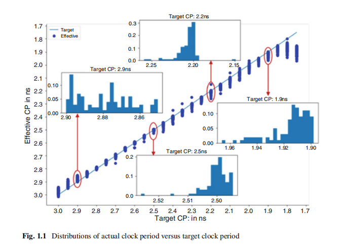
+ 可操作的预测(Actionable Predictions): 部分预测结果偏离实际应用范围；由于芯片设计是个多阶段工程，应用预测的结果，可能会改变原来的预测结果。
+ 基础设施的需求(Infrastructure Needs)： 
    ---
    为了实现基于机器学习的设计质量结果（QoR）预测，需要构建大量的新基础设施。具体来说，以下四个方面的需求是关键的：
    1. **知识产权保护**：设计所有者、代工厂和EDA提供商需要确保他们的知识产权（设计功能、技术参数、受保护的语法等）得到充分保护。这可能通过标准的匿名化和混淆机制来实现。
    2. **避免知识产权侵权风险**：机器学习研究人员、代工厂和EDA工具用户需要确保他们使用机器学习来改进集成电路（IC）设计启用和流程不会引发知识产权侵权索赔。例如，需要达成共识，是否可以共享基于学习的模型，如延迟计算器的“误差与SPICE”模型。
    3. **吸引学术研究人员**：应吸引学术研究人员参与大量的机器学习建模挑战，并提供支持数据和激励措施（例如，为IC设计中的机器学习创建一个“Kaggle”平台）。
    4. **共享责任和标准化平台**：长期来看，设计、EDA和研究社区必须共同负责部署一个标准的机器学习平台，用于EDA和IC设计建模，该平台涵盖设计指标收集、工具和流程模型生成、设计自适应工具和流程配置，以及工具和流程结果的预测。
    总之，为了推动基于机器学习的IC设计QoR预测，需要建立新的基础设施，确保知识产权保护，避免侵权风险，吸引学术研究，并共同开发一个标准化的机器学习平台。
    ---
+ The Bar for Design QoR Prediction

### 1.3 ML Techniques in QoR Prediction
用于质量质量预测的机器学习技术大致可以分为以下几类:
+ 图形神经网络（GNNs）。电路网表通常被建模为超图或图；因此，将gnn应用于质量质量预测是很自然的。
+ 长短期记忆（LSTM）网络。物理设计的实现实际上是一个分阶段的顺序过程，其中当前阶段的状态在很大程度上取决于以前各阶段的结果。LSTM网络是递归神经网络（RNN）的一种变体，LSTM网络可以通过记忆前阶段的重要信息来捕获这些时间序列信息。
+ 强化学习（RL）。在EDA工具中实现的算法有许多暴露的参数设置，用户可以调整，以实现所需的功率-性能-面积（PPA）结果。虽然物理设计工程师可能会使用不同的工具配置执行大规模并行工具运行，以实现良好的QoR，但这既耗时又资源效率低。强化学习可以训练一个自主代理，迭代地学习调整“循环中没有人”的参数设置。
+ 其他模型。传统的ML技术，如(i)线性回归，（ii）前馈神经网络，（iii）梯度增强的决策树，和（iv）随机森林（RF），也可以用于QoR预测。

### 1.4 Timing Estimation

+ 时序是设计质量结果（QoR）最重要的标准之一。在所有时序指标中，最常用的仍然是最大负松弛（WNS）和总负松弛（TNS）。
+ Timing is one of the most important design QoR criteria. Among all the timing metrics, worst negative slack (WNS) and total negative slack (TNS) are still the most commonly used.

#### 1.4.1 问题定义(Problem Formulation)
+ **背景**：为了达到最佳的最终时序结果，设计团队通常会使用不同的工具配置进行并行物理设计（PD）运行，进行功率、时序和面积的探索。鉴于紧张的流片进度、有限的工具许可和计算资源，这是一个压力非常大的过程。

+ **目标**：在寻求设计实施可能达到的绝对极限时，大多数运行注定会失败，即无法满足给定的时序约束。如果能够在设计流程的早期阶段识别出这些注定失败的运行，那么可以缩短芯片设计的周转时间（TAT），并且更高效地利用计算资源。

在设计的早期阶段，给定一个网表n、时钟周期cp和单元密度d，预测物理设计实施是否能够成功满足时序约束，具体表现为后路由的总负松弛（TNS）。

#### 1.4.2  预测流程(Estimation Flow)

在布局和时钟树综合（CTS）过程中，选择了三个中间物理阶段——详细布局、PlaceOpt和CTSOpt——来进行顺序建模。对于每个中间阶段，使用图神经网络（GNNs）以网表图作为输入来执行每个阶段的总负松弛（TNS）预测。此外，还使用长短期记忆（LSTM）网络通过将三个建模阶段的GNN基于嵌入作为顺序输入来执行最终的TNS预测。一旦所有TNS预测都可用，注定失败的运行将立即终止。

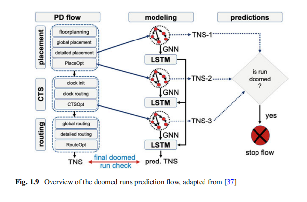

#### 1.4.3 特征工程(Feature Engineering)
节点的时序、功率特征从时序报告，功率报告以及技术文档中提取，所有的特征都是基于领域知识人工选择的。

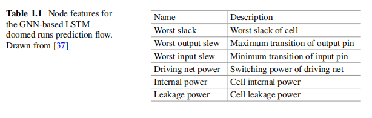

#### 1.4.4 机器学习引擎(Machine Learning Engines)
图1.10展示了基于GNN的LSTM框架的详细架构。左侧展示了顺序流程建模，其中来自不同物理实施阶段的网表的GNN基于嵌入被作为顺序输入送入LSTM网络。右侧展示了单阶段建模，其中当前阶段的网表的GNN基于嵌入被输入到一个专门的前馈神经网络中，以获得当前阶段的TNS预测。
所有三个物理实施阶段共享同一个GNN模块，从而提高了训练框架的可泛化性。

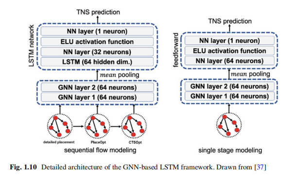

### 1.5 设计空间探索(Design Space Exploration)
设计空间探索（DSE）是提高设计质量结果（QoR）的一项关键技术。对于给定的设计和物理实施流程，可能存在三种类型的参数：(i) 架构参数，如CPU核心的位宽；(ii) 设计约束，如时钟周期和芯片的裸片尺寸；以及(iii) EDA工具的调节旋钮，如布局引擎的时序驱动和拥塞驱动选项。设计空间探索的最简单方法是在第1.4节提到的，运行大量不同配置的物理设计（PD）运行。然而，近年来，基于机器学习（ML）的自动化设计空间探索越来越受到关注。

#### 1.5.1 问题定义(Problem Formulation)

布局参数优化问题的强化学习（RL）公式定义如下：给定一个网表n，找到p∗ = argminp∈PH P WL(p)，其中P是布局引擎的参数组合集合，HPWL是返回的布局解决方案的后布局半周长线长。

#### 1.5.2 估计流程(Estimation Flow)

为了训练一个自动调整放置引擎的RL代理的参数设置，需要定义以下四个关键元素：状态、动作、状态转移、奖励
+ **状态**： 状态集合包括网表集N和布局引擎的所有可能参数设置（P）。表1.2列出了布局引擎的目标参数，其中包括6×10^9种可能的参数设置。一个单一的状态s由一个唯一的网表n和一个特定的参数设置p组成。

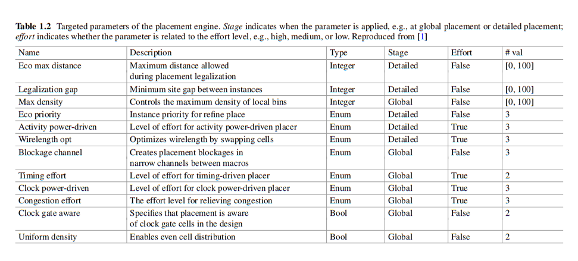

+ **动作**： 智能体可以用来更新参数设置（即P的值）的动作。在每一episode中，RL智能体不能改变网表。表1.3中展示了11种不同的动作。

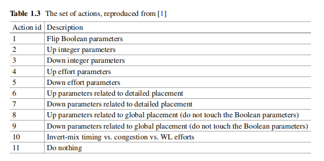

+ **状态转移**： 给定一个状态（St）和一个动作（At），下一个状态（St+1）是具有更新后参数设置的相同的网表。

+ **奖励**： 奖励被定义为布局引擎给出的后布局线长（-HPWL）的负值。如果动作在最小化后布局线长方面改进了参数设置，奖励会增加。为了训练一个智能体，使其在可能在线长方面有显著差异的各种网表上表现良好，奖励通过基准后布局线长进行了归一化。其中，HPWL_Human_Baseline是网表预期的基准后布局线长，可以通过手动运行一次布局引擎来获得。

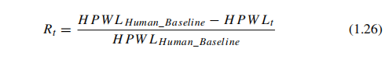

强化学习智能体通过与布局引擎的互动学习，以优化布局参数。在每个回合中，智能体根据策略选择动作，并基于布局结果获得奖励。在回合中，网表保持不变，只有参数设置会改变。回合结束时，智能体达到一个终端状态，随后开始新的回合。每个回合持续16个时间步。

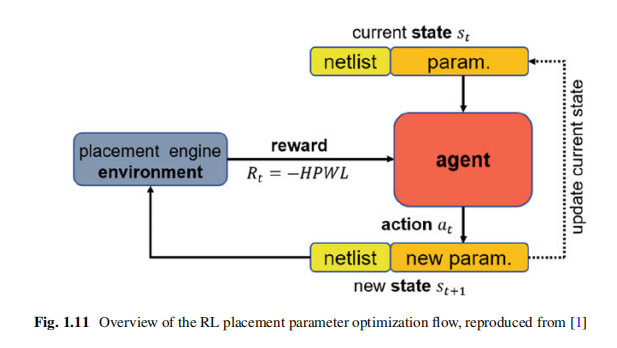

#### 1.5.3 特征工程(Feature Engineering)
网表表示包括元知识（number of cells, floorplan area等），图的拓扑特征，和由图神经网络得到的图嵌入。

#### 1.5.4 机器学习引擎(Machine Learning Engines)

智能体由一个深度神经网络表示，如图1.13所示。首先，布局参数p与从输入网表n中提取的特征进行连接，然后通过两个全连接的前馈层（FC层）进行处理，这些层具有tanh激活函数，并接着通过一个FC线性层。之后，引入了一个长短期记忆（LSTM）模块。此外，添加了一个序列到一维的全局注意力机制，以帮助LSTM模块关注递归的重要部分。最后，LSTM模块的隐藏状态被输入到策略网络和价值网络中，这两个网络各自包括两个具有tanh激活函数的FC层。策略网络和价值网络分别使用softmax层和线性层作为输出层。

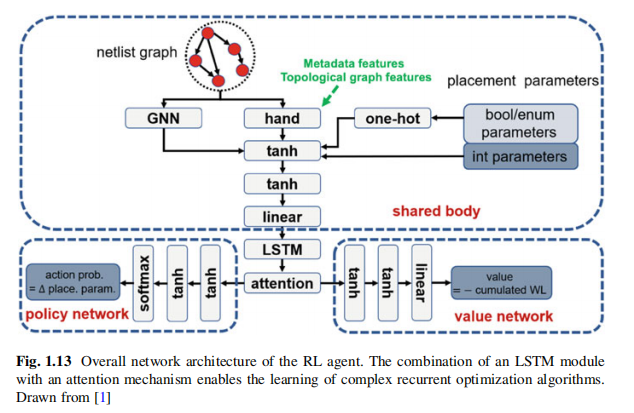

除了RL智能体的网络架构之外，训练布局参数优化智能体还有两个主要问题：（i）工具运行的延迟，因为执行一次布局可能需要几分钟到几小时；（ii）数据的稀疏性，因为没有可能数百万个网表、布局设计的数据库。为了缓解这两个问题，实现了A2C的并行版本。如图1.14所示，一个智能体通过多个智能体并行地与各自环境的副本交互来学习。通过一个确定性的实现，等待每个智能体完成其经验片段（根据步骤模型提供的当前策略）后，再对网络权重进行一次批量更新。

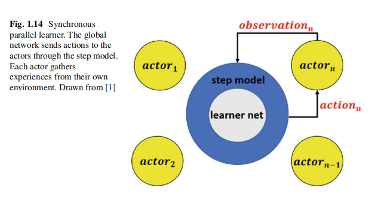

### 1.6 总结(Summary)

在本章中，我们介绍了基于机器学习的设计质量结果（QoR）预测的动机、挑战和基本技术。这种基于ML的设计QoR预测是设计基础等效缩放的一个强大杠杆，可以放大设计师和新产品实现半导体技术效益的能力。然而，实现通用的高质量QoR预测面临着样本数量有限、EDA工具和流程的混沌行为、在给定流程上下文中做出可操作预测的难度以及缺失的基础设施元素等挑战。长期以来，存在替代（如构建性或假设和强制）的设计QoR预测方法，这些方法经过数十年的磨砺，为基于ML的QoR预测的开发和部署带来了额外的挑战。
随着对ML技术（如GNN、LSTM和RL）的理解和理解的进步，研究人员在基于ML的QoR预测领域取得了迅速的进展。本章总结了几个关键技术，并详细描述了在时序估计和设计空间探索上下文中进行设计QoR预测的示例方法。

## Chapter 2: Deep Learning for Routability

### 2.1 Introduction

+ **背景**：随着半导体技术的发展，VLSI设计中需要遵循的设计规则变得更加复杂，DRC成为芯片流片的关键步骤。早期设计阶段的可布线性预测对于避免设计规则违规至关重要。

+ **目标**：为了提高可布线性预测的效率和准确性，深度学习技术在VLSI设计中的应用显示出巨大的潜力。本章将详细介绍基于DL的可布线性估计器，包括特征工程和模型架构设计，以及将这些估计器高效部署到物理设计流程中的探索。

### 2.2 Background on DL for Routability

#### 2.2.1 Routability Prediction Background

+ 设计规则违例(Design Rule Checking Violations): 在实践中，布局的可布线性可以通过不同的指标进行评估，其中最准确和广泛采用的测量方法是设计规则违规（DRV）。DRC检查特定的布局是否满足根据制造过程要求导出的约束。随着技术节点的进步，DRC规则的数量和复杂性增加，这要求可布线性预测采用不同的方法和ML模型。

+ 设计规则可以大致分为三类：
  - 大小规则：定义布局中组件/形状的最小长度或宽度。
  - 分离规则：定义每层两个相邻对象之间的最小距离。
  - 重叠/包含规则：定义两相邻层中两个连接形状之间最小重叠/覆盖量。

+ 布线拥塞和引脚可访问性(Routing Congestion and Pin Accessibility)：在高级技术节点（如20nm以下），随着设计规则的增加，布线拥塞和引脚可达性成为DRC违规的两个关键贡献因素。布线拥塞是通过比较布线需求和供应来估计的，而引脚可达性问题则由局部区域的高引脚密度引起。尽管布线拥塞是一个重要的可布线性指标，但它在预测DRC违规方面的相关性并不总是很高，尤其是在设计规则变得更加复杂时。因此，在高级技术节点上，可布线性的改进变得更加困难。

+ 相关物理设计步骤(Relevant Physical Design Steps): 在设计流程中，从RTL设计开始，经过逻辑综合生成门级网表后，进入物理设计阶段，其中设计组件在金属层上以具体几何表示实例化。这个阶段产生了可布线性问题和大多数可布线性估计。物理设计流程包括布局规划、电源规划、布局、时钟树综合、布线和物理验证等多个主要步骤，每个步骤可能包含多个子步骤。

+ 可布线性预测(Routability Prediction): 在设计流程中，DRC违规通常在布线完成后才能精确测量，此时修复违规的空间非常有限。为了提高布局的可布线性，需要早期预测方法来避免违规。然而，由于现代EDA工具中的布局和布线引擎行为复杂且不可预测，准确的早期可布线性预测非常困难。因此，研究人员转向开发基于数据的机器学习可布线性估计器，这些方法能够自动提取不同设计步骤之间的复杂相关性。细粒度的可布线性预测有助于在早期阶段识别DRC违规的详细位置，并指导布局修改以主动防止违规。粗粒度的预测则评估整个布局的可布线性，帮助识别可布线性的布局解决方案。

#### 2.2.2 DL Techniques in Routability Prediction

在可布线性预测中最常采用的深度学习技术来自计算机视觉领域，包括卷积神经网络（CNN）和全卷积网络（FCN）。这些技术的基本思想是将布局输入处理成像分类、分割和生成那样处理图像。每个深度学习技术都有许多变体。在CNN模型中，流行的模型包括ResNet、DilatedNet和DeepLabv3。对于FCN模型，流行的模型包括传统的FCN模型和UNet模型。此外，一些先前的工作使用条件生成对抗网络（cGAN）框架来训练基于FCN的模型。

CNN, FCN, GAN, NAS

#### 2.2.3 Why DL for Routability

### 2.3 DL for Routability Prediction Methodologies
本节介绍使用深度学习方法进行可布线性预测的流程，包括数据生成、特征工程、模型架构设计和训练推理。预测流程通常在布局规划后阶段应用，以利用更多布局决策。然而，后期阶段用于DRV缓解的空间较少。在布局规划之前，由于缺乏布局信息，设计必须作为图进行处理。

#### 2.3.1 Data Preparation and Augmentation

+ 目前，对于训练时使用的最小数据量还没有共识，因为不同工作之间的场景差异很大。但是，作为一个经验法则，建议至少生成数百个来自几个不同设计的布局，用于训练跨设计估计器。

+ 尽管我们面临着训练数据有限的挑战，但可以通过几种操作来扩大训练数据集的大小。对于相同的电路设计，可以通过向逻辑综合工具提供不同的参数来生成多个网表。同样，对于相同的网表，也可以生成多个布局。对于含有宏的设计，改变宏的位置可以非常高效地生成许多本质上不同的布局解决方案。

+ 可布线性问题最常见的数据增强技术包括水平翻转、垂直翻转和180度旋转。一些研究人员建议使用更激进的增强技术，如90度、270度旋转，随机裁剪和填充，随机裁剪和缩放等。然而，这些增强技术往往会产生不切实际的布局表示，因此在可布线性预测问题中并不十分合理，应非常谨慎使用。

+ 在数据预处理阶段，原始数据被转换为输入特征X和标签Y。布局被划分为w行h列的等尺寸网格，每个网格的特征值作为实数计算，形成输入张量X∈Rw×h×F。同样，布局的标签被提取为二维密度分布图，表示为Y∈Rw×h。对于DRV计数预测，标签是所有违规数量的求和。

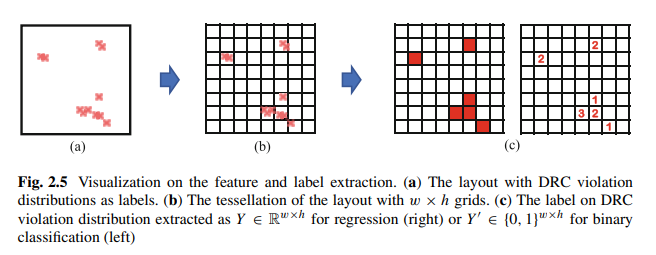

#### 2.3.2 Feature Engineering

特征工程在深度学习可布线性预测方法中起着关键作用，如果输入特征中缺少某些关键信息，那么机器学习模型几乎不可能学习相应的相关性并做出准确的预测。需要注意的是，可用的特征取决于应用模型的阶段。例如，如果模型目标是在布局之前应用，那么只能将宏的位置作为特征，而单元格的位置还未知。图2.6展示了每个设计阶段可用的特征和标签的基本物理设计流程。特征的选择严重依赖于物理设计和深度学习的专家知识，解决方案是特定于这个可布线性预测问题的。经过多年的探索，大多数EDA研究人员和工程师都认可了多种基本特征。它们可以大致分为几类。我们将在下面详细介绍这些特征。

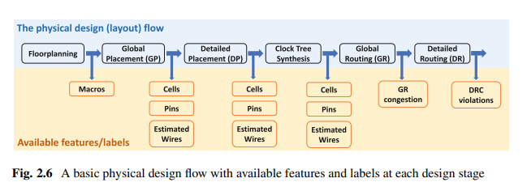

+ **阻塞(Blockage)**: 是指在布线过程中需要绕过的固定结构，如电源/接地层、输入/输出层等，它们会影响布线的可布线性。障碍物信息包括宏、单元和引脚的位置，这些信息可以通过不同的二维密度分布图来提取，以帮助机器学习模型更好地预测布线的质量。

+ **导线密度(Wire Density)**: 在布局的每个区域，导线密度越高，对布线轨道的需求越高，可能导致布线轨道溢出增加、布线拥塞加剧和更多DRC违规。因此，导线密度信息是可布线性估计器的关键输入。与直接可获得的障碍物信息不同，布局上的导线分布直到布线完成前都无法明确知道，这使得导线密度的提取需要估计，并已提出多种解决方案。其中，RUDY是最广泛使用的导线密度相关特征。常见特征有 RUDY, Short/Long-range RUDY map, Horizontal/vertical net density map, RUDY pins等。此外还有fly line特征，包括Pair-wise fly lines, Star fly lines, Source-sink fly lines, MST fly lines等。

+ **布线拥塞(Routing Congestion)**： 布局的布线拥塞是一个好的可布线性和DRC违规的指标，尽管不是完美的。因此，拥塞估计是很有用的输入特征，也被用作预测标签。商业布局工具可以生成两种类型的拥塞报告：试布线（TR）拥塞和全局布线（GR）拥塞。

+ **引脚可访问性(Pin Accessibility)**: 在先进技术节点，除了布线拥塞外，引脚可达性也是导致DRC违规的主要原因。引脚形状和引脚之间的接近关系与DRV相关。在高级节点使用大网格时，细粒度的引脚图案难以直接定量测量。为了解决这个问题，可以使用高分辨率的“图像”来显示引脚图案/配置作为输入特征，但这种高分辨率可能会增加可布线性估计器的计算成本。

+ **可布线性标签(Routability Label)**: 在可布线性预测中使用的不同类型的标签，包括直接预测布局中的所有DRC违规、选择预测某些类型的DRC违规以改善布局流程，以及仅预测布线拥塞以提高准确性，尤其是对于计划在早期设计阶段应用的模型。

#### 2.3.3 DL Model Architecture Design
+ **Common Operators and Connections**: 
本节详细介绍了用于可布线性预测的CNN/FCN方法中的运算符。CNN和FCN都使用卷积层、池化层和全连接层，CNN在下采样前扩大输入感受野，而FCN在下采样后进行上采样以获得细粒度的预测。CNN使用最大池化或步长为2的卷积层进行下采样，而FCN通常使用转置卷积层进行上采样。此外，还讨论了空洞卷积和子像素上采样块，以及CNN和FCN中常用的短路连接。

---
    空洞卷积（Atrous Convolution，也称为扩张卷积）是一种特殊的卷积操作，它在标准卷积核之间插入零以增加感受野的大小，同时保持卷积操作的计算复杂度不变。这种操作在图像处理中尤其有用，因为它可以增加卷积层捕获的图像区域的大小，而不需要增加计算量。例如，一个扩张率为2的空洞卷积层会在每个标准卷积核值之间插入一个零，从而将每个卷积核的视野扩大一倍。

    子像素上采样块（Sub-Pixel Upsampling Block）是一种用于图像上采样的技术，它通过对卷积层的输出进行像素重排来生成高分辨率图像。子像素上采样块通过在卷积层输出上应用像素重排操作，将一个较低分辨率的特征图转换为较高分辨率的特征图。这种方法不增加额外的可训练参数，并且计算成本较低。

    在CNN和FCN中，短路连接（Shortcut Connection）是一种连接技术，它允许将较低层的特征图直接传递到较高层，以帮助模型学习更复杂的特征表示。短路连接可以分为两种类型：
      1. 短程短路：这种类型的短路连接通常与残差块（Residual Block）一起使用，其中较低层的特征图被直接加到较高层的特征图上。这种连接允许模型学习残差信息，即输入特征与经过卷积层处理后的特征之间的差异。
      2. 长程短路：这种类型的短路连接通常与U-Net等结构一起使用，其中较低层的特征图被直接拼接到较高层的特征图上。这种连接支持浅层和深层特征图的组合，使得模型能够从特征混合中学习。
    总的来说，空洞卷积、子像素上采样块和短路连接都是CNN和FCN中常用的技术，它们有助于提高模型的性能和特征提取能力。
---

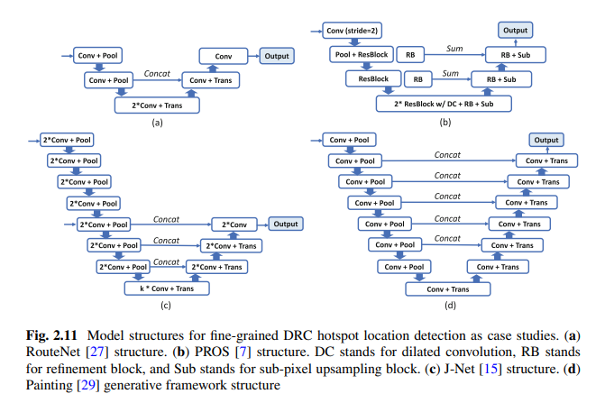

+ **Case Study: RouteNet**: RouteNet工作提出了两个模型：一个用于整体可布线性的预测，另一个用于定位DRC热点。整体可布线性的预测模型基于一个预训练的18层ResNet，而DRC热点定位模型基于一个六层卷积、两个池化和两个转置卷积的FCN。两个模型分别应用于全局布局和全局布线之后。

+ **Case Study: PROS**: PROS工作提出了一个基于FCN的复杂模型，用于在布线前定位全局布线拥塞的位置。模型下采样部分采用了预训练的ResNet网络，并进行了迁移学习。为了避免过多减少特征图大小，一些标准卷积层被扩张卷积层替换。上采样部分采用了子像素上采样块和细化块来恢复预测。

+ **Case Study: J-Net**: 提出了一个基于FCN的模型，用于在布线前定位DRC热点。与之前的工作相比，它针对的是亚10nm的先进工艺节点，其中引脚可达性成为DRC违规的主要原因。主要模型结构也是基于FCN，包含三个长程短路。为了处理引脚可达性问题，它采用了“高分辨率”的引脚配置图像作为额外输入，并设计了额外的下采样结构来从这些引脚配置输入中提取引脚可达性信息。

+ **Case Study: Painting**: Painting工作采用了基于cGAN的训练框架，用于FPGA上的可布线性预测。生成网络是一个具有五个长程短路的FCN模型，并与基于CNN的判别器网络一起在cGAN框架下进行训练。这种基于cGAN的训练方法与常见的基于FCN的方法之间的性能差异尚不清楚。

+ **Case Study: Automated Model Development**: 上述大多数可布线性模型都经过精心设计，并在自己的基准测试中取得了良好的结果。然而，这些精心设计的方法通常需要较长的开发时间和较高的工程工作量。最近的一项工作提出通过神经架构搜索（NAS）方法自动化模型开发步骤来避免这种成本[6]。它支持大搜索空间，允许各种类型的操作和高度灵活的连接。候选操作包括标准卷积、空洞卷积和混合深度卷积。在搜索空间中，模型由图表示。具体来说，顶点表示操作，边表示操作的有向连接。~~听起来像使用RL进行神经网络结构探索~~

#### 2.3.4 DL Model Training and Inference
在完成特征和标签预处理后，确定模型架构，深度学习模型的训练和测试相对简单。训练过程中，常用正则化方法如L2范数，以及Adam优化器。训练和推理通常使用GPU加速，但对于大FCN模型，GPU内存可能限制最大批大小，影响模型精度。特征提取开销可能大于模型推理时间。

### 2.4 DL for Routability Deployment
另一个重要主题是如何将开发的估计器应用于实际设计流程中，以提高设计可布线性。尽管这是一个重要话题，但研究较少，且尚未达成共识。接下来将介绍一些相关的研究探索。

+ **Direct Feedback to Engineers**： 将可布线性估计器直接应用于设计流程的最简单方法是向工程师提供反馈。工程师可以在布局完成后使用模型预测布线阶段的布线拥塞或DRC违规，并根据预测选择更可布线性的布局解决方案或主动改进布局以提高可布线性。

+ **Macro Location Optimization**： 在宏放置过程中，早期阶段缺乏有效指标来评估布局质量，因为最终性能取决于后续的复杂步骤。基于DL的可布线性估计器适合于改善宏放置的质量。通过将DL模型整合到模拟退火算法中，工作[11]能够预测设计规则违规的数量，从而选择较少违规的解决方案。

+ **White Space-Driven Model-Guided Detailed Placement**： 可布线性估计器可以在布局流程中主动减轻DRC违规。通过在潜在DRC热点区域传播空白空间，预测DRC热点位置后，收集热点周围的空白空间，并重新分配这些空白空间，可以实现这一目标。经过这种重新合法化方法后，布局在布线后DRC违规数量减少。

+ **Pin Accessibility-Driven Model-Guided Detailed Placement**： 模型指导的详细布局算法通过使用引脚可达性估计器生成的单元间距规则，优化布局以减少设计规则违反（DRV）。通过预插入布局障碍物，消除不良引脚模式，从而提高布线阶段的成功率。

+ **Integration in Routing Flow**： 全局路由利用路由估计器预测拥塞，调整gcell成本以减少潜在拥堵区域的线路，并通过深度学习模型降低DRV和拥塞。

+ **Explicit Routability Optimization During Global Placement**： 近期研究通过将路由拥塞预测直接整合到全局布局目标函数中作为一个新的惩罚项，显式优化布线可行性。这样，布局器可以利用梯度调整所有可移动单元，以在优化布局目标函数时提高布线可行性，这是针对给定布线估计器最直接和显式的布局解决方案优化方法。

+ **Visualization of Routing Utilization**： 除了优化布局方案的大多数应用外，一些研究[29]还将布线可行性估计器应用于可视化。它们在FPGA布局过程中实时可视化布线利用率，并以GIF或视频形式生成实时预测结果。

+ **Optimization with Reinforcement Learning**： 研究[22]表明，除了部署基于深度学习的布线可行性估计器外，待布线的网络顺序对布线质量有显著影响，并提出了一种基于强化学习的算法来学习最小化设计规则违反（DRC）的网络排序策略。

### 2.5 Summary
在概述了布线可行性和深度学习算法后，文章强调了全局信息和模型感受野的作用，并详细介绍了DL模型在布线预测中的应用方法。现有研究显示出前景，但DL布线估计器仍面临准确性、泛化、训练数据和模型大小等挑战。未来，这些估计器需要提高准确性、泛化能力，降低成本，并改善与设计流程的兼容性。
