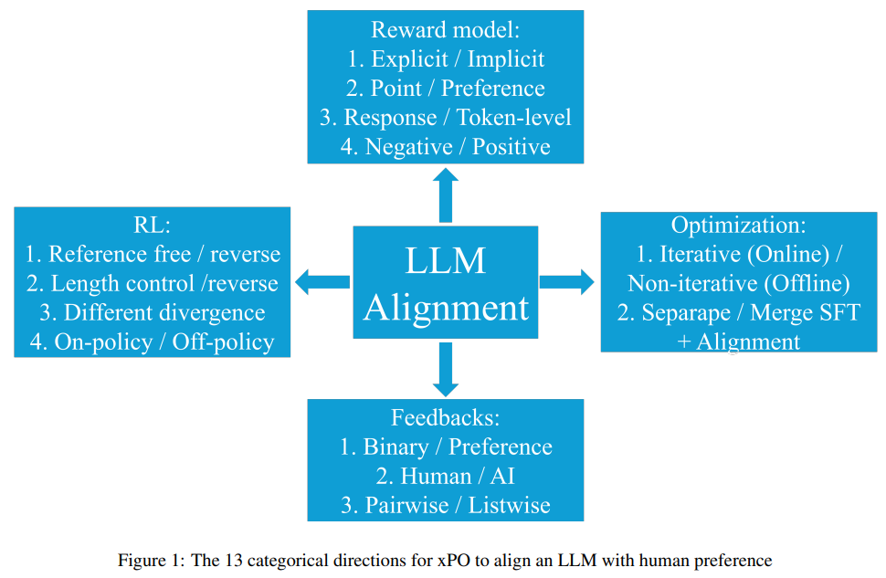
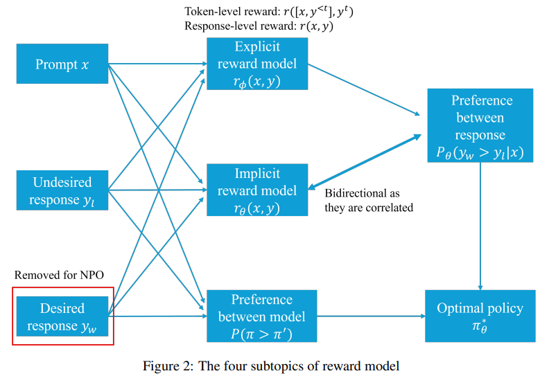
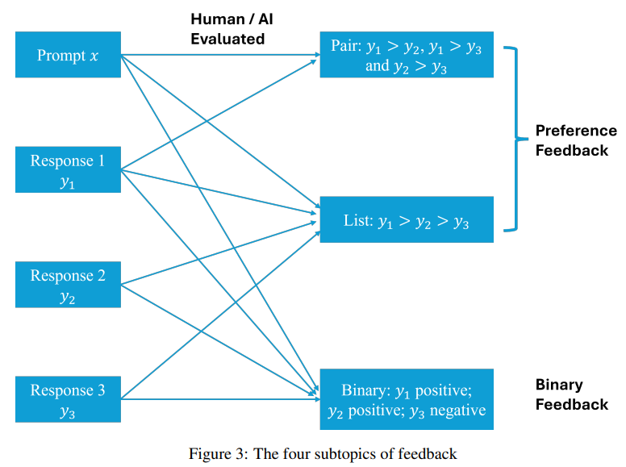
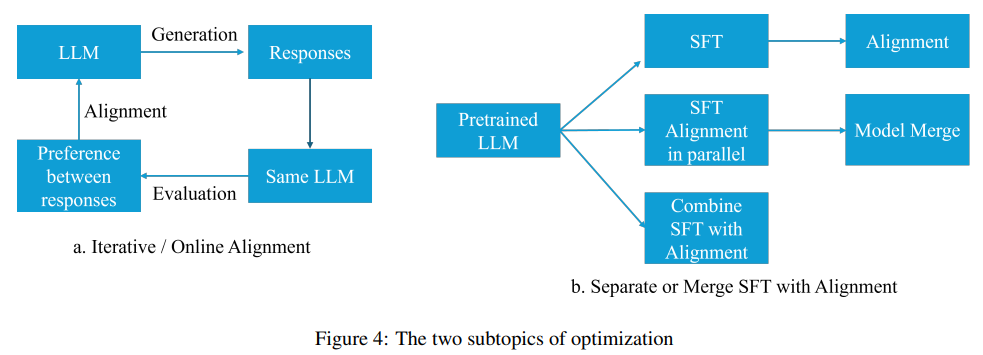

# A COMPREHENSIVE SURVEY OF LLM ALIGNMENT TECHNIQUES: RLHF, RLAIF, PPO, DPO AND MORE

### Abstract 
随着自监督学习、预训练语料库、指令微调和大型Transformer的发展，LLMs能够生成符合人类期望的响应。然而，由于训练数据质量不一，生成不期望响应的问题依然存在。过去两年，提出了多种方法来改善LLMs，特别是与人类期望的对齐。

### Introduction
过去几十年中，通过自监督学习对LLMs进行预训练取得了显著进展，这得益于更大的解码器Transformer、数万亿标记的使用和多GPU计算的并行化。预训练后，指令微调被用于指导LLMs对人类查询做出响应。尽管有这些进步，但一个关键问题仍未解决：LLMs可能会生成不期望的响应。为了减轻这种风险，将LLMs与人类价值观对齐至关重要。RLHF已成为对齐LLMs的一种突破性技术，推动了GPT-4、Claude和Gemini等强大模型的发展。

### 2 Categorical Outline

#### 2.1 Reward Model
在本节中，我们将讨论四种类型的奖励模型：
1. 显式奖励模型与隐式奖励模型：显式奖励模型通过微调预训练的LLM来直接为提示和响应分配分数，而隐式奖励模型则不需要显式训练，而是通过其他方式（如DPO中的映射）来对齐LLM。
2. 点奖励模型与偏好模型：点奖励模型为每个提示和响应分配一个分数，而偏好模型则基于用户偏好来对响应进行排序。
3. 标记级奖励模型与响应级奖励模型：标记级奖励模型为每个标记分配分数，而响应级奖励模型为整个响应分配一个分数。
4. 仅使用负面偏好训练奖励模型：这种模型只关注不期望的响应，并据此训练奖励模型。
这些不同的奖励模型在图2中有所展示。

##### 2.1.1 Explicit Reward Model vs. Implicit Reward Model
在RLHF中，研究人员收集了一个包含提示x、期望响应yw和不期望响应yl的三元组数据集。基于这个数据集，通过微调预训练的LLM，导出了显式奖励模型rϕ(x, y)，用于在RL环境中对齐LLM策略。隐式奖励模型rθ(x, y)则跳过了显式奖励模型的训练过程，例如在DPO中，通过建立最优奖励模型和最优策略之间的映射来实现对齐，无需直接推导奖励模型。

##### 2.1.2 Pointwise Reward Model vs. Preferencewise Model
在RLHF中，原始方法通过点奖励模型和Bradley-Terry模型估计期望响应优于不期望响应的概率。但这种方法不能直接获得成对偏好，且难以处理人类标注的不一致性。为此，提出了Nash学习，它直接建模期望响应优于其他响应的概率，以更好地处理这些问题。

##### 2.1.3 Response-Level Reward vs. Token-Level Reward
在RLHF和DPO中，奖励是基于Response-level的，而在马尔可夫决策过程中，奖励是在每个动作后给出的，这促使了Token-level奖励模型的引入。

##### 2.1.4 Negative Preference Optimization
在RLHF数据集中，人类既标记了期望响应也标记了不期望响应。最近，随着大型语言模型（LLM）能力的提升，一些研究人员认为LLM可以生成比人类标记者产生的高质量响应。因此，他们选择仅使用收集的数据集中的提示和不期望响应，使用LLM生成期望响应。

#### 2.2 Feedback
在本节中，我们将讨论三种类型的反馈：1. 偏好反馈与二元反馈；2. 成对反馈与列表反馈；3. 人类反馈与AI反馈。这些反馈的图表可以在图3中找到。

##### 2.2.1 Preference Feedback vs. Binary Feedback
在RLHF论文中，收集了偏好反馈，即yw > yl。然而，后续工作如KTO和DRO表明，偏好反馈更难收集，收集二元反馈（如“点赞”或“点踩”）可能更有优势。

##### 2.2.2 Pairwise Feedback vs. Listwise Feedback
在RLHF中，列表反馈被收集，即将多个响应视为成对比较。但后续研究，如LiPO，建议将列表偏好视为排序问题，而不是多个成对比较，这可能是更有优势的方法。

##### 2.2.3 Human Feedback vs. AI Feedback
RLHF通常需要人类比较多个响应，这既耗时又成本高。随着LLM的发展，现在可以使用AI来提供反馈，从而降低成本和时间。

#### 2.3  Reinforcement Learning (RL)
RL的目标是最大化响应奖励并最小化策略模型与初始参考模型之间的差异。讨论包括基于参考与无参考RL、长度控制RL、不同差异RL和在策略与离策略RL。
$$
\begin{align}
\pi^*_{\theta}(y|x) &= \max_{\pi_\theta} \mathbb{E}_{x \sim D} \left[\mathbb{E}_{y \sim \pi_\theta(y|x)} r(x, y) - \beta D_{KL} \large(\pi_\theta (y|x) || \pi_{ref} (y|x) \large) \right] \\

&=\max_{\pi_\theta} \mathbb{E}_{x \sim D, y \sim \pi_\theta (y|x)} \left[r(x,y) - \beta \log \frac{\pi_\theta (y|x)}{\pi_{ref} (y|x)} \right] \\

\end{align}
$$

##### 2.3.1 Reference-Based RL vs. Reference-Free RL
RLHF的目标是最小化当前策略和参考策略之间的距离。大多数方法集中在基于参考策略的方法上，但引入参考策略增加了内存负担。为了解决这个问题，提出了避免使用参考策略的方法，如SimPO。

##### 2.3.2  Length-Control RL
使用LLM评估时，它们倾向于偏好冗长的回答，即使没有提供额外信息。这种偏见可能会影响LLM的对齐。此外，LLM回答的冗长性可能会增加人类阅读和理解所需的时间。为了解决这个问题，后续工作如R-DPO和SimPO包含了长度控制的考虑。

##### 2.3.3 Different Divergences in RL
在RLHF中，反向KL散度用于评估策略差异，但会降低响应多样性。研究正在探索其他散度度量以改善这一问题。

##### 2.3.4 On-policy or Off-policy Learning
在RL中，on-policy学习从最新策略中采样响应，而off-policy使用较早的响应，这可能导致响应与当前策略不匹配。

#### 2.4 Optimization
在LLMs的对齐过程中，优化策略包括两种主要方法：迭代/在线偏好优化和非线性/离线偏好优化，以及分离SFT和Alignment与合并SFT和Alignment。迭代优化通过实时反馈调整模型，而非线性优化在训练后不再调整。分离SFT和Alignment先预训练后对齐，合并则同时进行，各有利弊。图4展示了这些策略的对比。

##### 2.4.1 Iterative/Online Preference Optimization vs. Non-Iterative/Offline Preference Optimization
使用收集的数据集进行对齐称为非迭代/离线优化。而人类标记新数据或LLMs同时生成和评估响应时，可实现迭代/在线优化。

##### 2.4.2 Separating SFT and Alignment vs. Merging SFT and Alignment
在RLHF中，传统方法是将SFT和alignment分开进行，这可能导致效率低下和遗忘问题。ORPO和PAFT等研究尝试通过将两者结合或同时进行微调来解决这些问题。

### 3 Individual Paper Reviews in Detail

#### 3.1 RLHF/PPO
LLMs训练时使用了质量不一的语料库，且其主要目标与安全有效地遵循用户指令相悖，可能导致输出不真实或有害。RLHF和PPO旨在通过人类反馈微调模型，以更好地与用户意图对齐。

##### 3.1.1 InstructGPT
OpenAI开发了InstructGPT，用于训练ChatGPT和GPT-4。通过引入人类偏好，解决了LLMs响应评价与人类偏好不一致的问题。这涉及奖励模型学习和RL策略训练两个步骤。

在训练InstructGPT时，使用了三个数据集：1. SFT数据集，包含用于训练SFT模型的标签员演示。2. RM数据集，由标签员对模型输出的排名组成，用于训练RM。3. PPO数据集，由用作RLHF微调输入的提示组成。尽管任务复杂，但标注者之间的一致性率相当高。

作者训练了一个单一的6B奖励模型，用于训练不同大小的RLHF/PPO策略模型。他们还尝试了更大的175B奖励模型。尽管更大的RM表现出较低的验证损失，但它们的训练过程不稳定，并且显著增加了RLHF/PPO的计算需求。

训练的InstructGPT从三个角度进行评估：有帮助性、诚实性和危害性。从人类评估来看，InstructGPT在真实性任务和毒性任务上优于GPT-3，这对于对齐至关重要。PPO-ptx也在各种NLP基准测试上表现出性能下降减少。

##### 3.1.2  RLHF - Anthropic
Anthropic 和 OpenAI 的研究主要在以下方面有所不同：
1. 标注者选择：OpenAI 通过筛选一致性较高的工作者，获得了较高的标注者一致性。而 Anthropic 则认为，具有良好写作能力并能与 AI 进行更深入交流的工作者可能更擅长判断哪些 AI 响应更有帮助和更安全，但其研究人员与其众包工作者之间的一致性较低。
2. 数据收集方法：两个研究主要关注了两个指标：“安全”和“有帮助”。OpenAI 的 InstructGPT 模型有 13 亿参数，而 Anthropic 评估了七个不同规模的模型，从 1300 万到 520 亿参数，呈几何级数增长。Anthropic 研究发现，对于较小的模型，对齐会降低性能，而对于较大的模型，特别是 130 亿和 520 亿参数的模型，对齐则能提高性能。
3. RLHF 方法：OpenAI 引入了 PPO 和 PPO-ptx，以减轻对 NLP 基准测试的影响。而 Anthropic 的研究发现，仅使用 PPO 就可以为较大的模型提供对齐奖励，并确定了 RL 策略训练中 KL 散度的最佳参数为 β = 0.001。
4. 奖励模型：Anthropic 发现奖励模型准确性与模型和数据集大小之间存在近对数线性关系。较大的奖励模型在 RL 策略训练期间比较小的模型更稳健。他们还将偏好数据分为训练集和测试集，分别训练了训练 RM 和测试 RM。训练 RM 用于训练 RLHF 策略，而测试 RM 用于评估。评估过程中发现，训练和测试 RM 在训练初期得分相近，但最终会发散，测试 RM 提供的得分较低。这表明奖励模型过拟合了训练数据，但在使用较大的 RM 时，这种过拟合问题对 RLHF 策略的影响较小。
5. 在线训练模式：Anthropic 研究了在线训练模式，其中奖励模型和 RL 策略每周都可以通过众包工作者的交互更新。这些发现并未在 OpenAI 的 InstructGPT 论文中报道。

##### 3.1.3  Online / Iterative RLHF
RLHF是一种技术，用于通过人类反馈优化LLM。传统方法使用离线数据集训练奖励函数，然后优化策略。DPO是RLHF的替代方法，直接使用数据集优化策略，但离线数据集可能不足以处理分布外数据。在线学习通过偏好模型训练和迭代策略优化解决这一问题，实践中的迭代学习包括使用增强策略探索不确定区域，然后更新主策略，这种方法通常比离线RL训练的模型表现更好。

#### 3.2 RLAIF
RLAIF（Reinforcement Learning from AI Feedback）框架的开发旨在减少获取人类偏好数据集的高成本。随着LLMs能力的不断提升，这种方法能够收集更准确的AI偏好数据集，从而增强LLMs与人类偏好的对齐。

##### 3.2.1  RLAIF-Anthropic
RLAIF是一种新方法，基于RLHF，分为两个阶段：1. 使用“宪法”指导的批评和修订进行监督学习，2. RLAIF。在第一阶段，LLM作为批评者提供修订，自我监督的批评和修订可以超越人类表现。第二阶段，RLAIF替换了RLHF，AI系统标记无害性数据，使用宪法和CoT推理原则对齐LLM。研究表明，通过AI收集偏好数据，自我监督的AI对齐是可行的，但仅限于无害性，因为确保无害性的任务比确保帮助性简单。

##### 3.2.2 RLAIF-Google
作者扩展了Anthropic的RLAIF研究，比较了人类和AI反馈的有效性。他们设计了一个四部分的提示结构来收集AI反馈，并采用两步评估过程。在RLAIF中，使用了两种策略：蒸馏RLAIF和直接RLAIF。评估基于AI和人类标签器的一致性、响应被选择的概率以及无害响应的百分比。实验结果表明，RLAIF在摘要和有用对话生成任务中与RLHF性能相当，但在无害任务中表现更好，并且能够增强SFT策略，甚至在标签器与策略大小相同时也有效。直接RLHF在一致性方面优于蒸馏RLHF。

#### 3.3 Direct Human Preference Optimization
传统的RLHF方法通过优化基于人类偏好的奖励函数来训练模型，但这种方法增加了计算复杂性和偏差-方差问题。最新的研究尝试直接根据人类偏好优化LLM策略，而不是通过奖励信号，从而简化了对齐过程，减少了计算成本，并可能实现更稳健的优化。

##### 3.3.1 SliC-HF
研究引入了SLiC-HF方法，通过最大间隔排序损失和正则化，使LLMs与人类偏好对齐。SLiC-HF有直接使用人类反馈（SLiC-HF-direct）和生成多个响应再排序（SLiC-HF-sample-rank）两种变体。后一种变体使训练更稳定有效。研究表明，SLiC-HF在计算资源较少的情况下，性能不亚于RLHF/PPO，且在Reddit TL;DR摘要任务上优于后者。这表明SLiC-HF是LLMs与人类偏好对齐的有前景方法，平衡了性能、计算效率和实现简便性。

$$
L_{\text {SLiC-HF }}\left(\pi_{\theta}\right)=\max \left(0, \delta-\log P_{\theta}\left(y_{w} \mid x\right)+\log P_{\theta}\left(y_{l} \mid x\right)\right)-\lambda \log P_{\theta}\left(y_{\text {ref }} \mid x\right)
$$

##### 3.3.2 RSO
RSO（Rejection Sampling Optimization）是一种改进的离线偏好优化方法，通过使用拒绝采样来解决训练数据与最优策略数据分布不匹配的问题。RSO利用训练好的奖励模型rϕ(x, y)来指导采样过程，选择接近最优策略的响应，从而提高训练数据的效率和质量。实验结果表明，RSO在多个指标上优于之前的SLiC和DPO方法，并且具有更好的可扩展性和跨任务泛化能力。RSO提供了一种更原理化的方法来生成近似于策略RL的训练数据，其统一的框架和智能采样策略可能成为其他离线训练方法的催化剂。

##### 3.3.3 DPO

$$
L_{\mathrm{DPO}}\left(\pi_{\theta}\right)=-\mathbb{E}_{\left(x, y_{w}, y_{l}\right) \sim D} \log P_{\theta}\left(y_{w}>y_{l} \mid x\right)=-\mathbb{E}_{\left(x, y_{w}, y_{l}\right) \sim D} \log \left\{\sigma\left[\beta \log \left(\frac{\pi_{\theta}\left(y_{w} \mid x\right)}{\pi_{\mathrm{ref}}\left(y_{w} \mid x\right)}\right)-\beta \log \left(\frac{\pi_{\theta}\left(y_{l} \mid x\right)}{\pi_{\mathrm{ref}}\left(y_{l} \mid x\right)}\right)\right]\right\}
$$
DPO（Direct Preference Optimization）在OpenAI的RLHF方法中存在一些局限性。RLHF方法中的奖励模型保持不变，便于人类对齐。对于相关任务的进一步训练，只需要新的提示，由LLM生成响应，并从现有的奖励模型中获得奖励。这种方法在灵活性和可重用性方面具有显著优势。相比之下，DPO需要新的偏好数据来进行进一步优化，这可能很难获得，因为它需要细致的人工标注。DPO的损失函数专注于最大化期望响应和非期望响应之间的差异，可能会导致无意中减少期望响应的奖励或增加非期望响应的奖励。最近的研究表明，DPO对基本模型输出和偏好数据之间的分布偏移特别敏感，可能导致性能不佳。为了解决这个问题，提出了迭代DPO，其中使用最新的策略模型生成新的响应，并在每次迭代中使用批评进行偏好标记。这种方法可以帮助缓解分布偏移问题，并可能提高DPO的性能。最后，DPO论文中的测试主要是在简单的情况下进行的，应该评估更复杂的下游NLP任务来评估DPO的有效性。

##### 3.3.4 DPOP:Smaug

论文总结了DPO损失函数的局限性，特别是在处理小编辑距离数据时的不足。作者通过理论分析指出，DPO可能导致期望和非期望响应的奖励同时增加或减少，只要它们之间的差异增大。为了解决这一问题，作者创建了三个包含更多小编辑距离示例的数据集，并提出了DPO-positive（DPOP）损失函数。DPOP通过引入一个新项，激励模型在标准DPO损失的基础上，提高对期望响应的生成概率，从而有效防止期望响应奖励的减少。

$$
L_{\mathrm{DPOP}}\left(\pi_{\theta}\right)=-\mathbb{E}_{\left(x, y_{w}, y_{l}\right) \sim D}\left\{\log \left[\sigma\left(\beta \log \left(\frac{\pi_{\theta}\left(y_{w} \mid x\right)}{\pi_{\mathrm{ref}}\left(y_{w} \mid x\right)}\right)-\beta \log \left(\frac{\pi_{\theta}\left(y_{l} \mid x\right)}{\pi_{\mathrm{ref}}\left(y_{l} \mid x\right)}\right)\right)\right]-\lambda \max \left(0, \log \left(\frac{\pi_{\mathrm{ref}}\left(y_{w} \mid x\right)}{\pi_{\theta}\left(y_{w} \mid x\right)}\right)\right)\right\}
$$

利用改进的损失函数，作者训练并评估了不同规模的Smaug模型，在Huggingface LLM排行榜和MTBench上取得了优异表现，其中70B规模的模型在论文发表时达到了state-of-the-art水平。

##### 3.3.5 $\beta$-DPO

问题：
- DPO损失函数的性能对偏好数据质量下的权衡参数β的微调非常敏感。
- 最优的β值会随着偏好数据质量的变化而变化，需要动态调整。
- 现实世界的数据集中可能包含异常值，这些异常值会扭曲优化过程。

改进：
1. 动态β校准：引入了批次级别的动态β校准，根据成对数据的质量为每个批次调整β。
2. β引导的数据过滤：通过基于奖励差异的概率模型过滤掉异常值，以减轻它们对优化过程的影响。

效果：
- 在不同的模型大小和采样温度下，β-DPO在Anthropic HH和Reddit TL;DR摘要任务上始终优于标准DPO。
- 在Anthropic HH数据集上，β-DPO在包括Pythia-410M、1.4B和2.8B在内的各种大小的模型上实现了超过10%的改进。
- 对于低差距数据，较高的β会降低胜率，而对于高差距数据，增加β会提高性能，这表明了根据数据质量调整β值的重要性。

未来工作：
- 探索β-DPO在自博弈场景中的应用。
- 开发更复杂的评估指标来更全面地衡量模型性能。
- 研究β-DPO在超大型模型上的可扩展性。
- 追求自动化的参数调整方法，以简化模型优化过程。

##### 3.3.6 IPO
问题：
1. RLHF和DPO存在过拟合问题。
2. 在确定性条件下，使用BT模型将成对偏好替换为点奖励模型时，可能导致过拟合。

$$
L_{\mathrm{IPO}}\left(\pi_{\theta}\right)=-\mathbb{E}_{\left(x, y_{w}, y_{l}\right) \sim D}\left[\log \left(\frac{\pi_{\theta}\left(y_{w} \mid x\right)}{\pi_{\mathrm{ref}}\left(y_{w} \mid x\right)}\right)-\log \left(\frac{\pi_{\theta}\left(y_{l} \mid x\right)}{\pi_{\mathrm{ref}}\left(y_{l} \mid x\right)}\right)-\frac{1}{2 \beta}\right]^{2}
$$

改进措施：
1. 引入IPO（Identity Preference Optimization）作为解决方案。
2. 提出了一种新的目标函数，避免了通过BT模型基于点奖励进行偏好转换，而是专注于优化偏好的非线性函数。
3. 提出了一个新的损失函数，可以避免BT模型将点奖励转换为偏好概率。

效果：
1. 当惩罚系数β足够大时，IPO成功地避免了过拟合，而DPO倾向于过拟合。
2. 通过添加噪声修改的DPO预计可以充分解决这个问题。
3. 进一步的实验需要在下游NLP任务中验证IPO方法的优势。

##### 3.3.7 sDPO 

在DPO（决策过程优化）中，参考模型对于保持SFT（监督微调）和下游任务的性能至关重要。sDPO方法通过逐步对齐偏好数据集，提高了DPO训练效果。实验表明，sDPO在ARC、HellaSWAG、MMLU和TruthfulQA任务上得分超过了传统的DPO方法。使用更新参考模型初始化目标模型可以降低初始损失函数，提高训练效率。然而，对于生成任务的影响尚不明确，需要进一步实验来探讨。

##### 3.3.8 GPO
作者提出了一种广义偏好优化（GPO）方法，旨在通过最大化期望响应与负面响应之间的差异来改进模型的性能。在GPO中，作者使用了泰勒展开来分析偏好优化的效果，并将此过程分为两部分：偏好优化和离线正则化。偏好优化关注于最大化响应差异，类似于奖励机制；而离线正则化则致力于最小化当前策略与参考策略之间的差异，类似于KL散度。

#### 3.4 Token-level DPO
DPO将奖励赋予提示和响应的整体，而MDP为每个动作分配奖励。后续研究细化了DPO在Token-level的应用。
